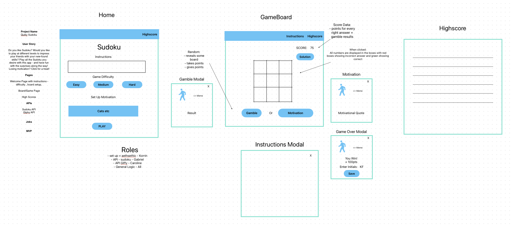

# Sudoku

### Contact Information

#### Caroline 

- **GitHub:** [Cazbella](https://github.com/Cazbella)
- **Email:** cazbella@myyahoo.co.uk

#### Korrin

- **GitHub:** 
- **Email:** 

#### Gabriel

- **GitHub:** 
- **Email:** 

## Table of Contents
- [Description](#description)
- [Installation](#installation)
- [Usage](#usage)
- [Contributing](#contributing)
- [Questions](#questions)

## Description

Find the deployed application here: 

https:

Welcome to <project name>! This project is

# User Story

Do you like Sudoku? Would you like to play at different levels to impress your friends with your new-found skills? Play all the Sudoku you desire with this app - and have fun with the surprises along the way! Losing motivation? Click for a treat!

Features:
- Responsive Design: The game ...
- Skills - A comprehensive list of the skills used is
- Pages and features  
- 
- profiles in order to ontact me via these methods. 

### Challenges

We planned using a wireframe

Upon loading you can click on 'Home' and see the home page, as shown below. 

### Credit

I had help from my 

## Installation
Installation:
1. Clone the repository: git clone https:
2. Navigate to the project directory: cd react-portfolio
3. Install dependencies: npm install
4. Start the development server: npm start

Visit http://localhost:3000 to view the app in your browser.

**Dependencies:**
react-fontawesome`: ^0.2.0
- `@popperjs/core`: ^2.11.8
- `bootstrap`: ^5.3.2
- `react`: ^18.2.0
- `react-dom`: ^18.2.0
- `react-router-dom`: ^6.10.0

**DevDependencies:**
- `@types/react`: ^18.2.43
- `@types/react-dom`: ^18.2.17
- `@vitejs/plugin-react`: ^4.2.1
- `eslint`: ^8.55.0
- `eslint-plugin-react`: ^7.33.2
- `eslint-plugin-react-hooks`: ^4.6.0
- `eslint-plugin-react-refresh`: ^0.4.5
- `vite`: ^5.0.10

## Usage

Upon loading you can click on 'Home' and see the home page, as shown below. 

Use the buttons in the navigation bar to explore the pages, as shown in the below images.

Grid Page

High Scores PAge...

## Contributing
Contributions to this project are welcome and encouraged! If you have ideas for new features, find a bug, or want to improve the documentation, feel free to contribute. To contribute to the project fork the repository on GitHub. Clone your forked repository to your local machine. Create a new branch with a descriptive name for your contribution: git checkout -b feature/new-feature or git checkout -b bug/fix-bug. Then make your changes and commit them with a clear message. Push your changes to your forked repository and open a pull request in the main repository with a detailed description of your changes. Please follow the project's coding style and adhere to the existing conventions. By contributing, you agree that your contributions will be licensed under the project's license. Thank you for helping make our project better!